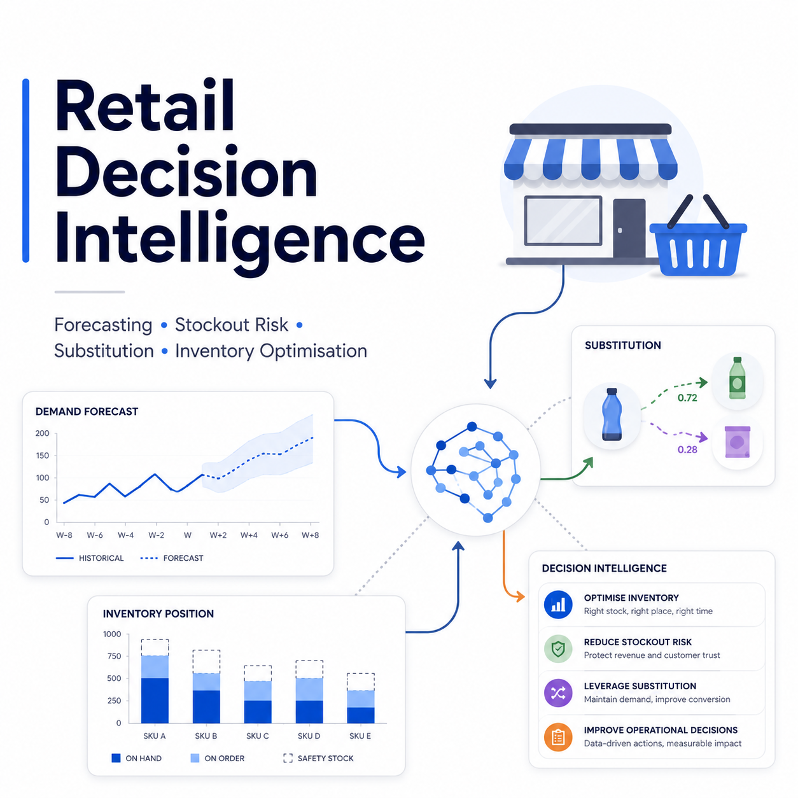
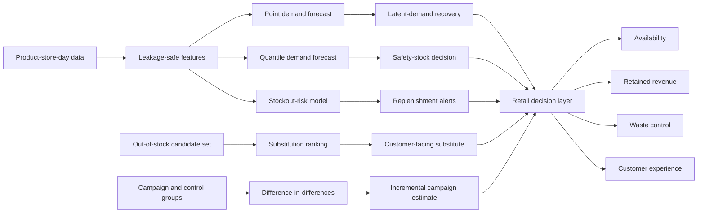

# Retail Decision Intelligence

**An end-to-end retail AI framework for demand forecasting, latent-demand recovery, stockout-risk prediction, product substitution, promotion evaluation, explainable machine learning, and inventory optimisation.**

[](https://www.python.org/)
[](notebooks/Retail_Decision_Intelligence.ipynb)
[](#data-and-simulation-design)
[](#reproducibility)



## Overview

Retail decisions are coupled across multiple operational levels. A stockout is not merely an inventory event: it censors observed demand, changes customer choice, transfers sales to substitute products, alters future forecasts, and can reduce customer trust. Similarly, a promotion affects demand, replenishment, availability, substitution pressure, waste, and margin simultaneously.

This project develops a unified, decision-centred analytical workflow that connects these processes. It uses a reproducible synthetic product-store-day panel calibrated to broad parameter ranges reported in peer-reviewed retail and forecasting studies. The workflow demonstrates how machine learning, probabilistic forecasting, causal analysis, and optimisation can be translated into operational decisions.

> **Important:** All transactions, customer choices, products, stores, prices, promotions, and inventory events are simulated. The reported results measure performance within a controlled synthetic benchmark. They are not evidence from a specific retailer and should not be interpreted as production performance.

## Project objectives

The analysis addresses seven commercially relevant questions:

1. Can a global machine-learning model outperform a seasonal-naive forecast across many product-store series?
2. How much customer demand becomes hidden when observed sales are censored by stockouts?
3. Can stockout risk be identified early enough to support replenishment intervention?
4. Can attribute-aware ranking select more acceptable substitutes than simple price matching?
5. Can campaign effects be separated from seasonality and persistent store differences?
6. Can probabilistic forecasts improve service level while reducing inventory decision cost?
7. Which features drive model predictions, and where does model performance vary across store formats?

## Executive results

| Decision outcome | Synthetic benchmark result | Interpretation |
|---|---:|---|
| Forecast WAPE reduction | **31.8%** | Demand-corrected LightGBM outperformed the seasonal-naive baseline. |
| Demand forecast WAPE | **0.502** | Weighted absolute percentage error against simulated latent demand. |
| Nominal 90% interval coverage | **93.8%** | Quantile forecasts slightly over-covered the nominal interval. |
| Stockout ROC-AUC | **0.747** | The classifier provided useful discrimination between stockout and non-stockout observations. |
| Substitution acceptance gain | **+13.4 percentage points** | Attribute-aware ranking improved top-1 acceptance over closest-price matching. |
| Campaign uplift estimate | **47.8%** | Directionally recovered the simulated campaign effect; robust statistical uncertainty remained. |
| Inventory decision-cost reduction | **6.9%** | The probabilistic policy reduced the defined combined lost-sales and waste cost. |
| Service-level improvement | **+29.2 percentage points** | Service level increased from 66.7% to 95.8% in the simulated policy comparison. |

The campaign estimate is illustrative rather than definitive because the robust interaction p-value was 0.082. The result demonstrates the analytical design and recovery of the expected direction, not conclusive causal evidence.

## Analytical architecture



## Data and simulation design

The dataset contains **38,880 daily product-store observations**:

| Property | Value |
|---|---:|
| Date range | 1 January 2024 to 23 June 2025 |
| Chronological test cutoff | 29 April 2025 |
| Stores | 4 |
| Store formats | Convenience, urban, and superstore |
| Products | 18 |
| Product categories | Bakery, beverages, dairy, fresh, household, and plant-based |
| Variables | 26 |
| Random seed | 42 |

Each row represents one product in one store on one day. Variables include product attributes, brand tier, perishability, health score, pack size, regular price, realised price, discount, campaign exposure, holiday status, temperature, expected demand, latent demand, inventory availability, observed units sold, stockout status, and lost sales.

### Micro-level mechanism

The simulation separates customer demand from retailer fulfilment:

\[
Y_{spt}=\min(D_{spt}, I_{spt}),
\]

where \(D_{spt}\) is latent customer demand, \(I_{spt}\) is available inventory, and \(Y_{spt}\) is observed sales for store \(s\), product \(p\), and day \(t\).

When \(D_{spt}>I_{spt}\), observed sales are censored. A forecasting model trained only on \(Y_{spt}\) can therefore learn that suppressed sales represent weak demand, even though the true cause is insufficient stock. The notebook models latent demand using overdispersed count behaviour, calendar effects, product-store heterogeneity, price response, promotions, weather, campaigns, and random variation.

### Systems-level mechanism

At the system level, the project treats forecasting, availability, substitution, promotion, and inventory as linked components rather than isolated models:

- demand forecasts determine replenishment and safety stock;
- inventory constraints censor observed sales;
- stockouts alter customer choice and substitute-product demand;
- promotions shift demand and can create downstream availability pressure;
- probabilistic forecasts express uncertainty required for cost-sensitive decisions;
- model calibration determines whether predicted probabilities can support operational thresholds;
- inventory policy translates predictions into service, lost-sales, waste, and margin outcomes.

## Methods

### 1. Leakage-safe feature engineering

All lagged and rolling variables are shifted so that each prediction uses only information available before the target date. The final 56 days form a chronological holdout set. This design avoids future leakage and more closely resembles deployment than a random train-test split.

Representative features include:

- 7-, 14-, and 28-day demand lags;
- shifted rolling means and variability;
- day-of-week, month, and seasonal indicators;
- current price and discount;
- promotion and campaign status;
- product category and store format;
- product, brand, tier, size, perishability, and health attributes;
- store affluence and weather variables;
- available stock for stockout-risk modelling.

### 2. Demand forecasting

Three forecasting strategies are compared:

- **Seasonal naive:** predicted demand equals sales from the same weekday one week earlier.
- **Observed-sales LightGBM:** a global model trained directly on observed sales.
- **Demand-corrected LightGBM:** a global model trained on a transparent stockout-day demand proxy.

The simulated latent demand is retained only as an evaluation target. This makes it possible to quantify error and bias introduced by censored sales.

Forecast evaluation includes:

\[
\mathrm{WAPE}=\frac{\sum_i |y_i-\hat{y}_i|}{\sum_i y_i},
\]

along with mean absolute error, root mean squared error, bias, and root mean squared logarithmic error.

### 3. Probabilistic forecasting

LightGBM quantile models estimate the 5th, 50th, 90th, and 95th conditional demand quantiles. The 5th-to-95th percentile interval is evaluated for empirical coverage and width. The 90th quantile supports a service-oriented inventory policy.

### 4. Explainability

Permutation importance measures the increase in forecast error after each feature is randomly disrupted. This model-agnostic method identifies variables that materially contribute to predictive performance without assuming that model associations are causal.

### 5. Stockout-risk prediction

A class-weighted LightGBM classifier predicts whether latent demand will exceed available stock. Evaluation includes:

- ROC-AUC;
- average precision;
- Brier score;
- precision-recall curves;
- threshold-specific confusion matrices;
- probability calibration.

An operational threshold is selected using the \(F_2\) score, which places greater weight on recall when missed stockouts are considered more costly than false alerts.

### 6. Product-substitution ranking

Each simulated out-of-stock event contains four candidate products. A logistic ranking model estimates candidate acceptance using:

- relative price difference;
- pack-size difference;
- health-score difference;
- same-brand indicator;
- same-tier indicator;
- category compatibility;
- customer affinity;
- prior-purchase match;
- candidate display position.

The model selects one top-ranked candidate per event and is compared with closest-price and purchase-history heuristics.

### 7. Promotion-effect estimation

A difference-in-differences model compares the plant-based category with control categories around a simulated January campaign:

\[
\log(1+Y_{sct})=\beta_0+\beta_1T_c+\beta_2P_t+\beta_3(T_cP_t)
+\alpha_s+\gamma_t+\varepsilon_{sct},
\]

where \(T_c\) identifies the treated category, \(P_t\) identifies the post-campaign period, \(\alpha_s\) represents store fixed effects, and \(\gamma_t\) represents week fixed effects. Heteroskedasticity-consistent HC3 standard errors are used.

### 8. Inventory optimisation

Two policies are compared:

- **Seasonal-naive policy:** last-week demand plus a simple safety buffer.
- **Probabilistic ML policy:** the estimated 90th demand quantile.

The decision layer evaluates service level, lost units, waste units, retained-margin proxy, average stock, and total decision cost:

\[
C=c_L L+c_W W,
\]

where \(L\) represents lost units, \(W\) represents waste units, and the penalties vary with product perishability and commercial assumptions.

## Model performance

### Demand forecasting

| Model | MAE | RMSE | WAPE | Bias | RMSLE |
|---|---:|---:|---:|---:|---:|
| Demand-corrected LightGBM | 7.462 | 10.921 | **0.502** | -0.909 | 0.982 |
| Observed-sales LightGBM | 7.467 | 10.985 | 0.502 | -1.276 | **0.976** |
| Seasonal naive | 10.950 | 16.024 | 0.737 | -0.383 | 1.342 |

The corrected model produced only a modest change in absolute forecast error relative to the observed-sales model, but reduced negative bias. This distinction is operationally important because persistent under-forecasting can propagate repeated stockouts.

### Store-format diagnostics

| Store format | Test observations | WAPE | Bias |
|---|---:|---:|---:|
| Superstore | 2,016 | **0.473** | -1.228 |
| Urban | 1,008 | 0.535 | -0.861 |
| Convenience | 1,008 | 0.562 | -0.318 |

Performance heterogeneity indicates that a single global model still requires format-specific monitoring, calibration, and operational thresholds.

### Substitution policy

| Policy | Top-1 acceptance | Mean retained-revenue proxy |
|---|---:|---:|
| ML attribute-aware | **40.4%** | **1.927** |
| Purchase-history heuristic | 32.2% | 1.511 |
| Closest price | 27.0% | 1.341 |

The result shows that substitution is a multidimensional customer-choice problem. Price similarity alone does not capture brand, size, tier, category, health, affinity, or purchase-history compatibility.

### Inventory policy

| Policy | Service level | Lost units | Waste units | Total decision cost | Retained-margin proxy | Average stock |
|---|---:|---:|---:|---:|---:|---:|
| Seasonal-naive policy | 66.7% | 19,981 | **8,024.8** | 63,084.1 | 50,532.4 | 16.22 |
| Probabilistic ML policy | **95.8%** | **2,515** | 17,079.0 | **58,712.2** | **54,904.4** | 27.81 |

The probabilistic policy increased stock and waste but substantially reduced lost sales, improving service level and lowering the defined total decision cost. This illustrates why forecast accuracy alone is insufficient: the optimal policy depends on the relative costs of lost sales, waste, holding inventory, and customer dissatisfaction.

## Repository structure

```text
retail-decision-intelligence/
├── README.md
├── requirements.txt
├── assets/
│   ├── retail_decision_intelligence_infographic_design.png
│   └── figures_montage.png
├── notebooks/
│   └── Retail_Decision_Intelligence.ipynb
├── manuscript/
│   └── Retail_Decision_Intelligence_Full_Manuscript.docx
├── outputs/
│   ├── synthetic_retail_panel.csv
│   ├── executive_scorecard.csv
│   ├── forecast_metrics.csv
│   ├── segment_performance.csv
│   ├── substitution_policy_results.csv
│   ├── inventory_policy_results.csv
│   ├── simulation_metadata.json
│   └── 01_daily_demand.png ... 13_inventory_outcomes.png
└── src/
    ├── build_retail_notebook.py
    └── create_retail_manuscript.py
```

## Getting started

### 1. Clone the repository

```bash
git clone https://github.com/mpetalcorin/retail-decision-intelligence.git
cd retail-decision-intelligence
```

### 2. Create a virtual environment

macOS or Linux:

```bash
python3 -m venv .venv
source .venv/bin/activate
```

Windows PowerShell:

```powershell
python -m venv .venv
.venv\Scripts\Activate.ps1
```

### 3. Install dependencies

```bash
python -m pip install --upgrade pip
pip install -r requirements.txt
```

### 4. Open the executed notebook

```bash
jupyter notebook notebooks/Retail_Decision_Intelligence.ipynb
```

Run **Kernel ‚Üí Restart Kernel and Run All Cells** to reproduce the analysis.

## Reproducibility

The notebook uses a fixed NumPy random seed of `42`. It writes generated artefacts to an output directory during execution. The committed `outputs/` directory contains the reference results used in the manuscript and this README.

Key dependencies are:

- NumPy;
- pandas;
- SciPy;
- scikit-learn;
- LightGBM;
- statsmodels;
- Matplotlib;
- Jupyter and IPython kernel.

Because numerical libraries and model implementations can change, small differences may occur across operating systems, processor architectures, and package versions. For stricter reproducibility, create and commit a version-locked environment after testing on the target platform.

## Generated outputs

The notebook produces thirteen visual analyses:

1. network latent demand and observed sales;
2. stockout rate by category;
3. promotion multiplier distribution;
4. forecast WAPE comparison;
5. probabilistic demand forecast;
6. permutation feature importance;
7. store-format forecast performance;
8. stockout precision-recall curve;
9. stockout probability calibration;
10. substitution acceptance by policy;
11. substitution tier-transition matrix;
12. campaign difference-in-differences visualisation;
13. normalised inventory-policy outcomes.

A journal-style manuscript with embedded figures, complete methods, discussion, peer-reviewed references, and supplementary tables is available at:

```text
manuscript/Retail_Decision_Intelligence_Full_Manuscript.docx
```

## Scientific and operational interpretation

### Forecasting

Global models pool statistical information across products and stores. This is valuable when individual product-store series are short, intermittent, promotional, or noisy. The global model improved the aggregate benchmark, but segment-level diagnostics show that pooled learning does not remove the need for local monitoring.

### Latent demand

Observed sales are a joint outcome of customer demand and inventory availability. Treating sales as demand creates a measurement problem whenever stockouts occur. Demand recovery is therefore not a cosmetic preprocessing step; it changes the target that replenishment models are attempting to predict.

### Probabilistic decisions

A point forecast does not state the chance that demand will exceed stock. Quantile forecasts support explicit service-level choices and allow different policies for high-margin, essential, promotional, or perishable products.

### Stockout risk

Probability calibration matters alongside ranking. A well-ranked but poorly calibrated model may assign probabilities that cannot be translated safely into intervention thresholds, staffing requirements, or replenishment urgency.

### Substitution

Substitution quality depends on customer-product compatibility. A substitute can be similar in price while being unacceptable in pack size, dietary profile, brand, product tier, or purchase context. Event-level ranking aligns model evaluation with the actual decision: which item should be offered first?

### Promotion evaluation

Sales increases during a campaign are not automatically caused by the campaign. Seasonality, store differences, category trends, stockpiling, cannibalisation, and availability can confound the association. Difference-in-differences provides a stronger design than a simple before-after comparison but still requires pre-trend assessment and credible controls.

### Inventory optimisation

A forecast becomes valuable only through the decision it changes. Increasing service level can require additional stock and may increase waste. The correct policy depends on the complete cost function, including margin, spoilage, fulfilment, shelf capacity, supplier constraints, and long-term customer effects.

## Limitations

- The dataset is synthetic and cannot establish external validity for a real retailer.
- Demand-censoring correction uses a deliberately transparent proxy rather than a full latent-state or expectation-maximisation model.
- The notebook uses one chronological holdout; production work should add rolling-origin backtests and disruption-specific validation.
- The substitution-choice process is simulated and should be replaced with real acceptance, rejection, refund, complaint, and repeat-purchase outcomes.
- The promotion analysis requires stronger pre-trend, spillover, cannibalisation, and post-promotion diagnostics for production causal inference.
- The inventory model omits lead-time uncertainty, supplier minimums, case packs, shelf capacity, labour, multi-echelon flows, and detailed freshness constraints.
- The project demonstrates reproducible analytical development, not a deployed production service or complete MLOps system.

## Production roadmap

A production extension should:

1. build a governed product-store-day feature table;
2. establish operational and seasonal-naive baselines;
3. reconstruct censored demand using inventory-event and replenishment timestamps;
4. run rolling-origin backtests with hierarchical weighted metrics;
5. train calibrated point and quantile forecasting models;
6. calibrate stockout probabilities and define cost-sensitive thresholds;
7. learn substitution rankings from real customer outcomes;
8. deploy models first in shadow mode;
9. connect every prediction to an action, owner, cost function, and monitoring rule;
10. measure incremental value through controlled experiments or credible quasi-experimental designs;
11. monitor drift, calibration, data quality, segment performance, and unintended consequences;
12. implement model registry, versioned training data, champion-challenger testing, and rollback criteria.

## Peer-reviewed scientific foundation

The simulation and analytical design were informed by the following peer-reviewed studies:

1. Makridakis, S., Spiliotis, E., and Assimakopoulos, V. (2022). M5 accuracy competition: Results, findings, and conclusions. *International Journal of Forecasting, 38*(4), 1346–1364. https://doi.org/10.1016/j.ijforecast.2021.11.013
2. Makridakis, S., Spiliotis, E., and Assimakopoulos, V. (2022). The M5 competition: Background, organization, and implementation. *International Journal of Forecasting, 38*(4), 1325–1336. https://doi.org/10.1016/j.ijforecast.2021.07.007
3. Ziel, F. (2022). M5 competition uncertainty: Overdispersion, distributional forecasting, GAMLSS, and beyond. *International Journal of Forecasting, 38*(4), 1546–1554. https://doi.org/10.1016/j.ijforecast.2021.09.008
4. Fildes, R., Ma, S., and Kolassa, S. (2022). Post-script—Retail forecasting: Research and practice. *International Journal of Forecasting*. https://doi.org/10.1016/j.ijforecast.2021.09.012
5. Powell, L. M., Kumanyika, S. K., Isgor, Z., Rimkus, L., Zenk, S. N., and Chaloupka, F. J. (2016). Price promotions for food and beverage products in a nationwide sample of food stores. *Preventive Medicine, 86*, 106–113. https://doi.org/10.1016/j.ypmed.2016.01.011
6. Rosin, M., Young, L., Jiang, Y., Vandevijvere, S., Waterlander, W., Mackay, S., and Ni Mhurchu, C. (2023). Product promotional strategies in supermarkets and their effects on sales. *Nutrition & Dietetics, 80*(5), 463–471. https://doi.org/10.1111/1747-0080.12800
7. Trewern, J., Chenoweth, J., Christie, I., and Halevy, S. (2022). Does promoting plant-based products in Veganuary lead to increased sales, and a reduction in meat sales? *Public Health Nutrition, 25*(11), 3204–3214. https://doi.org/10.1017/S1368980022001914
8. Luick, M., Bandy, L., Piernas, C., Jebb, S. A., and Pechey, R. (2024). Do promotions of healthier or more sustainable foods increase sales? *BMC Public Health, 24*, 1658. https://doi.org/10.1186/s12889-024-19080-x
9. Vasconcellos, L. H. R., and Sampaio, M. (2009). The stockouts study: An examination of the extent and the causes in the São Paulo supermarket sector. *Brazilian Administration Review, 6*(3), 263–279. https://doi.org/10.1590/S1807-76922009000300007
10. Anupindi, R., Dada, M., and Gupta, S. (1998). Estimation of consumer demand with stock-out based substitution: An application to vending machine products. *Marketing Science, 17*(4), 406–423. https://doi.org/10.1287/mksc.17.4.406
11. Hoang, D., and Breugelmans, E. (2023). “Sorry, the product you ordered is out of stock”: Effects of substitution policy in online grocery retailing. *Journal of Retailing, 99*(1), 26–45. https://doi.org/10.1016/j.jretai.2022.06.006

## Citation

To cite this repository:

```text
Petalcorin, M. I. R. (2026). Retail Decision Intelligence: Hierarchical demand
forecasting, stockout prediction, product substitution, promotion evaluation,
and inventory optimisation [Computer software and analytical notebook].
https://github.com/mpetalcorin/retail-decision-intelligence
```

BibTeX:

```bibtex
@software{petalcorin2026retail,
  author  = {Petalcorin, Mark Ihrwell R.},
  title   = {Retail Decision Intelligence},
  year    = {2026},
  url     = {https://github.com/mpetalcorin/retail-decision-intelligence},
  note    = {Synthetic retail forecasting, stockout, substitution, promotion, and inventory optimisation benchmark}
}
```

## Author

**Mark I. R. Petalcorin**  
Molecular biologist, biochemist, machine-learning and AI scientist  
GitHub: [@mpetalcorin](https://github.com/mpetalcorin)  
Portfolio: [a-aidea.com](https://a-aidea.com)

## Responsible use

This repository is intended for research, education, portfolio demonstration, and methodological development. Before operational use, models should be retrained and validated on governed retailer data, reviewed for commercial and customer impacts, calibrated under realistic costs and constraints, and evaluated through controlled deployment.


